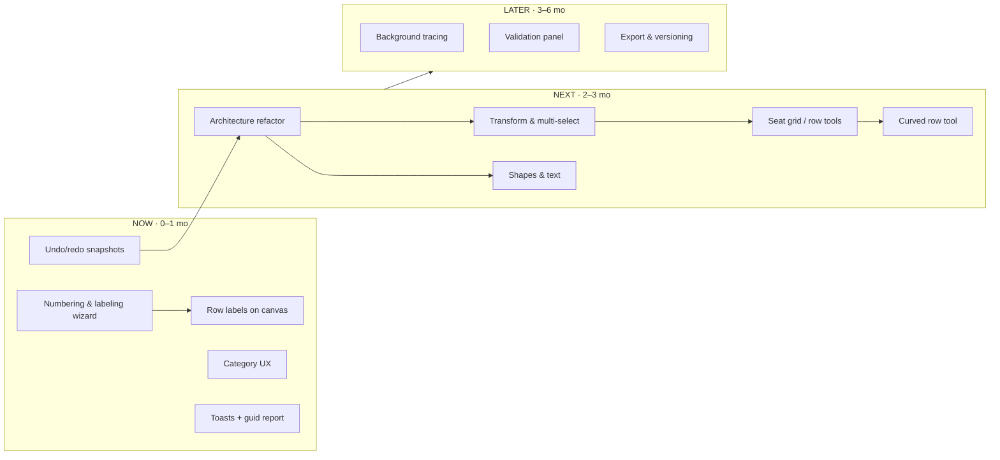
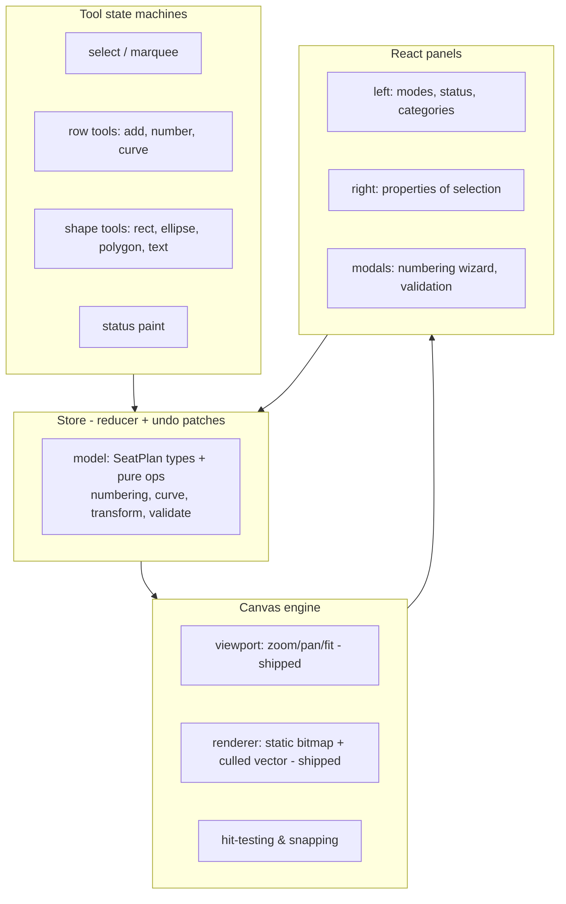

> ⚠️ AI DRAFT — PM REVIEW REQUIRED

# Seat Mapper v2 — UX Improvements & seats.pretix.eu Parity Plan

**Owner:** Faisal (PM) · **Drafted:** June 2026
**Goal:** evolve the tool from a bulk status editor into a full seat-plan *authoring* tool, so plans can be created and labeled for TipTip without seats.pretix.eu and without renaming rows one by one.

---

## 1. Context

- Today the tool renders pretix/TipTip seating JSONs and bulk-edits seat **status** (and category).
- Plans are authored in seats.pretix.eu, exported, then **manually relabeled**: pretix stores row identity as `row_number` ("AA") + bare `seat_number` ("18") + `seat_label` template ("AA%s"), but TipTip renders **only the seat label**, so every seat must be renamed to a fully-qualified label (e.g. `AA-18`) by hand. This is the single biggest time sink.
- Reference plan analyzed: *Opus Deccenium 1* (1,144 seats, 97 rows, 23 areas: 4 rect / 7 ellipse / 7 polygon / 5 text, curved rows, `row_number_position` start/end/both). Findings:
  - Curved rows are plain per-seat `position` offsets along an arc — generatable with math, no special schema.
  - `seat_guid` is human-readable (`Groundfloor-G-9`) and **21 duplicate guids exist in the source plan** (the tool currently auto-renames them silently on upload).
  - 17 seats carry a custom `radius`; pretix file has no `status` field (TipTip adds it).

### Schema cheat-sheet (fields the editor must read/write)

| Level | Fields |
|---|---|
| Plan | `name`, `size {width,height}`, `categories[{name,color}]`, `zones[]` |
| Zone | `name`, `uuid`, `zone_id`, `position`, `rows[]`, `areas[]` |
| Row | `uuid`, `position`, `row_number`, `row_number_position` (start/end/both), `seat_label` ("AA%s"), `seats[]` |
| Seat | `uuid`, `seat_guid`, `seat_number`, `position`, `category`, `radius?`, `status?` (TipTip) |
| Area | `uuid`, `shape` (rectangle/circle/ellipse/polygon/text), `position`, `color`, `border_color`, `rotation`, shape payload, `text {text,color,size,position?}` |

**Rule: never regenerate `seat_guid` on relabel** — TipTip keys bookings on it. Guid regeneration is only safe for brand-new plans (offer as an explicit, separate action).

---

## 2. NOW (0–1 mo) — kill the manual work

| # | Item | Why / What | Prio | Effort | ICE | Kano |
|---|---|---|---|---|---|---|
| N1 | **Seat numbering & labeling wizard** | The headline feature. Scope: all rows / selected rows. Set row names (keep, A–Z, AA–AZ, numeric, custom list, reverse). Set seat numbers (start, step, direction L→R / R→L, restart per row or continue). Label template with live preview (`{row}-{n}`, `{row}{n}`, …). Writes `seat_number` (TipTip mode) and/or `row_number` + `seat_label` (pretix mode). Never touches `seat_guid`. | P0 | M | 567 | Performance |
| N2 | **Render row labels on canvas** | Honor `row_number` + `row_number_position` (start/end/both) like pretix. Needed to *see* what N1 did. | P0 | S | 504 | Basic |
| N3 | **Undo / redo** | Snapshot stack (cap ~50) before each mutation; ⌘Z / ⇧⌘Z. Snapshot approach is fine at this data size; patch-based can come with the NEXT-phase refactor. A bulk tool without undo is dangerous. | P0 | S | 320 | Basic |
| N4 | **Category UX** | Friendly display names for UUID categories (editable alias + color swatch + per-category seat counts; click category → select/highlight its seats). Color editing + create/delete category. | P1 | S | 432 | Performance |
| N5 | **Replace `alert()`/blocking dialogs with toasts; duplicate-guid report** | Upload currently fires a blocking alert and silently renames 21 duplicate guids — show a non-blocking toast + downloadable report of what changed instead. | P1 | XS | 405 | Basic |
| N6 | **Autosave + recent files** | Persist working copy to localStorage/IndexedDB, restore on reload, warn before closing with unsaved changes. Drag-and-drop JSON onto the window to open. | P1 | S | 504 | Basic |
| N7 | **Status paint mode** | Pick a status, then click/drag across seats to apply directly — faster than select → dropdown → update for scattered seats. | P2 | S | 392 | Performance |
| N8 | **Find seat / jump to** | Search by label or guid, pan-zoom to result. Invaluable on 4k-seat maps. | P2 | XS | 320 | Performance |

✅ Already shipped (June 2026): cursor-anchored zoom/pan, fit-to-content, HiDPI rendering, dark-mode text fix, typing-safe shortcuts.

---

## 3. NEXT (2–3 mo) — become an editor (pretix parity core)

Maps to the pretix toolbar: select / row-select / seat-grid / single-seat / shapes / text / undo / cut-copy-paste / zoom / grid.

| # | Item | Notes | Prio | Effort |
|---|---|---|---|---|
| X1 | **Architecture refactor** (prerequisite) | Split the ~2k-line component: `model/` (types + pure mutation ops), `engine/` (canvas hooks: viewport, hit-test, render), `tools/` (one state machine per tool), `panels/` (React UI). Central reducer store; migrate undo to patches. | P0 | M |
| X2 | **Object transform** | Move (done for single objects), multi-select with shift, marquee in object mode, keyboard nudge, rotate handle, resize handles for areas, delete key. | P0 | M |
| X3 | **Add seats: grid & row tools** | Click-drag to stamp an n×m seat grid with spacing controls; add a single row; append/insert seats in a row; set default radius/category. | P0 | L |
| X4 | **Curved row tool** | Select row(s) → drag a bend handle (or numeric radius/angle). Recompute per-seat offsets along the arc with equal spacing; straighten action. Also: align/distribute rows. | P0 | M |
| X5 | **Shape drawing** | Rectangle, circle/ellipse, polygon (click-to-place vertices, drag to edit, double-click to finish), standalone text. Style panel: fill, border, rotation, text. | P1 | L |
| X6 | **Copy / paste / duplicate** | Within and across zones; pasted seats get fresh uuids/guids; smart label offset (paste row "A" → suggest "B"). | P1 | M |
| X7 | **Snap & grid** | Toggleable grid, snap-to-grid and snap-to-alignment guides while dragging. | P1 | S |
| X8 | **Zones management** | Create/rename/reorder zones (floors), move selection between zones, per-zone visibility toggle. | P2 | M |
| X9 | **Plan settings panel** | Name (exists), width/height editing, "trim canvas size to content" action, total seat count. | P2 | XS |

---

## 4. LATER (3–6 mo) — finish & delight

| Item | Notes | Prio | Effort |
|---|---|---|---|
| Background image tracing | Upload reference image, opacity slider, not saved into the JSON (pretix behavior). | P2 | S |
| Validation panel | Duplicate guids/labels, overlapping seats, seats without category, empty rows — with click-to-locate. | P2 | S |
| Minimap | Overview inset for very large plans. | P3 | S |
| PDF/PNG export | Print-quality plan export. | P3 | M |
| Multi-plan workspace / file versioning | Named saves, version history. | P3 | M |
| TipTip Retool round-trip | Direct import/export against the Retool-managed store instead of manual JSON copy. ⚠ Needs TipTip API access — flag before building (tool standards / approval). | P3 | M–L |

---

## 5. Phase flow

## 6. Target architecture (NEXT phase)

## 7. Open questions for PM

1. Exact TipTip label format(s) needed — is `{row}-{n}` (e.g. `Q3-97`) the only convention, or do some events use `{row}{n}` / section prefixes? (drives wizard presets)
2. Should the wizard optionally sync `seat_guid` for **new** plans (readable `Zone-Row-N` guids like pretix), behind a "new plan only" guard?
3. Is multi-zone (multiple floors as separate zones) actually used in TipTip exports, or is everything flattened to one zone? ⚠ Inferred from samples: both files seen so far are single-zone.
4. Priority call: is X3/X4 (authoring) truly needed before the next event setup, or does the NOW package (relabel existing pretix exports fast) cover the near-term workflow?
